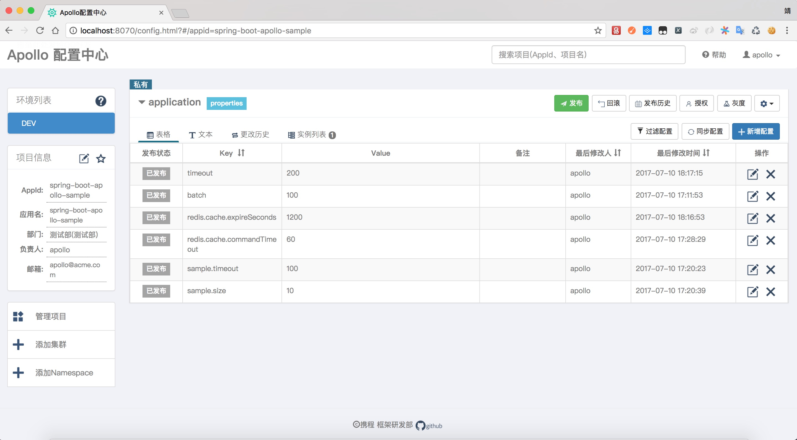

# spring-boot-apollo-sample
Demo project for Spring Boot Apollo

Spring Boot整合携程Apollo配置中心

## 客户端maven配置

* apollo-client(必须)

```xml
<dependency>
    <groupId>com.ctrip.framework.apollo</groupId>
    <artifactId>apollo-client</artifactId>
    <version>0.8.0</version>
</dependency>
```
* spring-boot-starter-actuator 和 spring-cloud-context

```xml
<dependency>
    <groupId>org.springframework.boot</groupId>
    <artifactId>spring-boot-starter-actuator</artifactId>
</dependency>
<dependency>
    <groupId>org.springframework.cloud</groupId>
    <artifactId>spring-cloud-context</artifactId>
    <version>1.2.2.RELEASE</version>
</dependency>
```

注意:

1、`apollo-client`为必须配置

2、`spring-boot-starter-actuator` 和 `spring-cloud-context`为可选配置。仅在使用`Spring Cloud`的`@RefreshScope`时所需

## 客户端使用



* Java Config结合Spring Placeholder方式

详见JavaConfigSample。JavaConfigSample使用Config API实现属性值变动实时修改

* Spring Boot ConfigurationProperties方式

详见ConfigurationPropertiesSample。

ConfigurationPropertiesSample并没有使用Config API实现属性值变动实时修改，而是采用Spring Cloud的@RefreshScope注解和/refresh端点来刷新属性值

注:本示例代码所有配置属性在Apollo 配置中心修改后立即生效。


# 参考文档

https://github.com/ctripcorp/apollo/wiki/